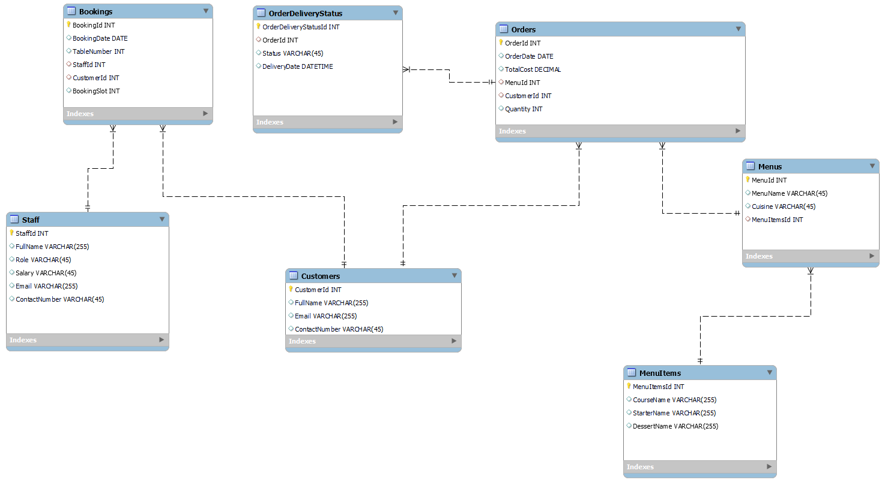
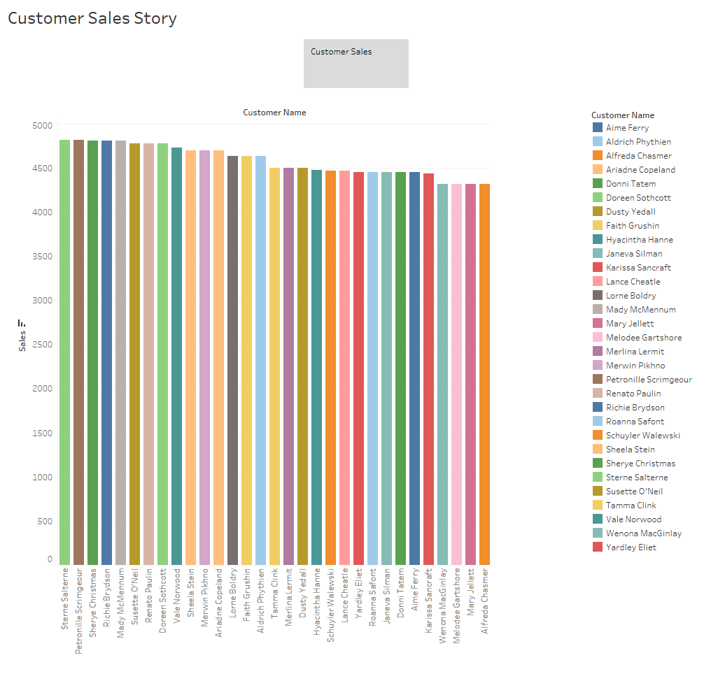
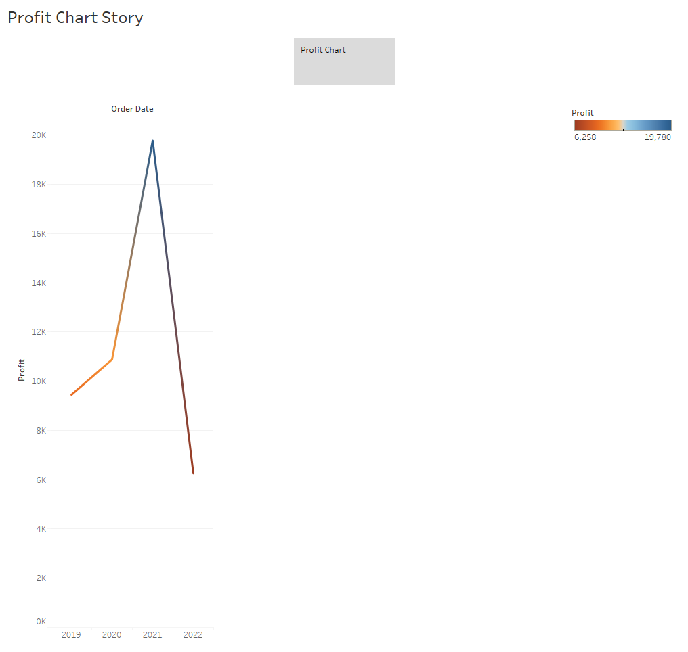
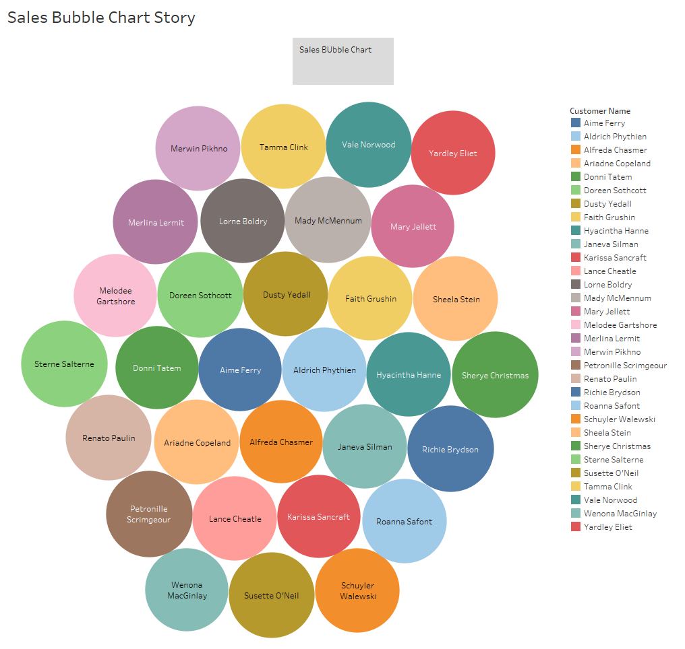
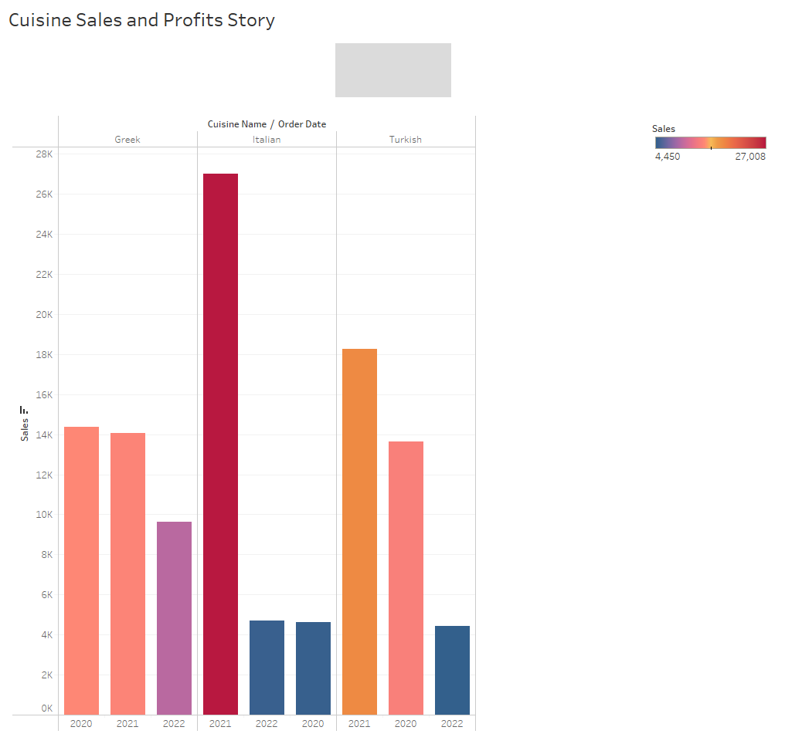
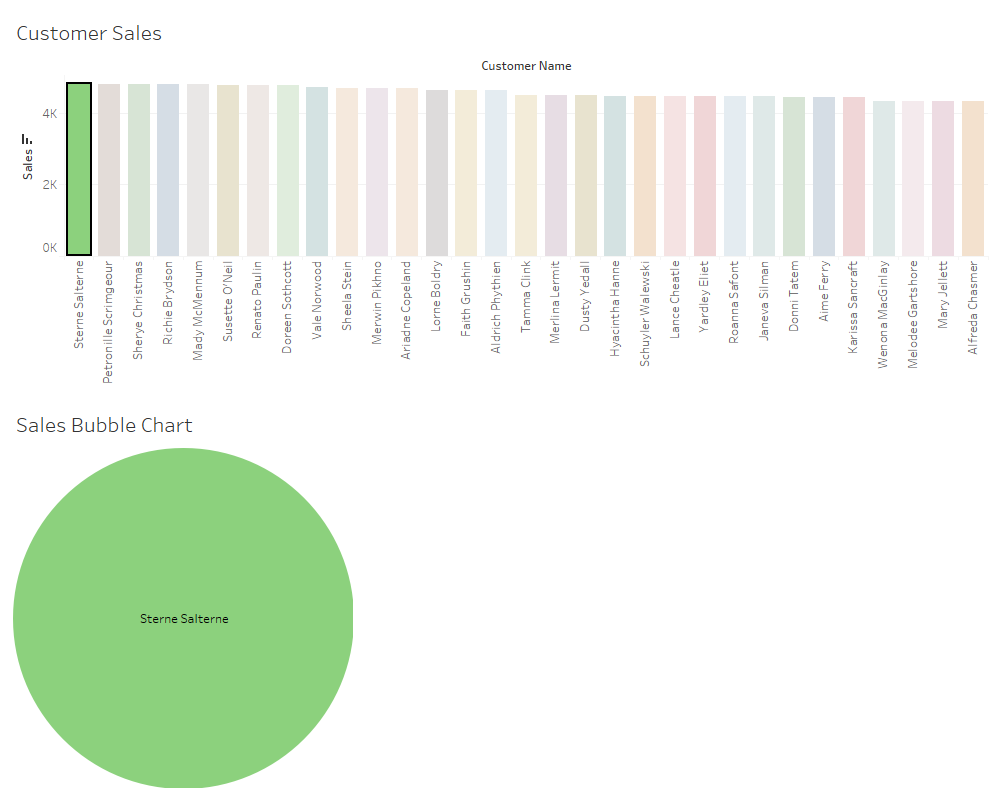

# Meta Database Engineer Capstone

by johnguaz

## Week 2 see [Notebook for stored procedures and queries](Database_Engineer_Capstone.ipynb)
- 
- [LittleLemonDB.sql](LittleLemonDB.sql)
- [Data inserted for db](data.sql)
- [Notebook for stored procedures and queries](Database_Engineer_Capstone.ipynb)

## Week 3
- 
- 
- 
- 
- 

- [Tableu Workbook](db-capstone-project-tableu.twb)

## Week 4 [Notebook for stored procedures and queries](Database_Engineer_Capstone.ipynb)
- [Notebook for connection and queries](Database_Engineer_Capstone.ipynb)